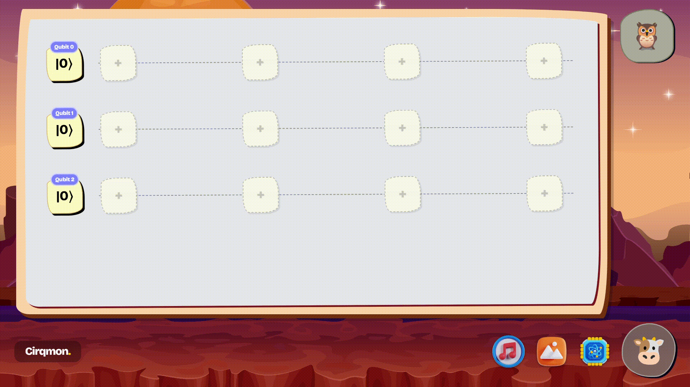
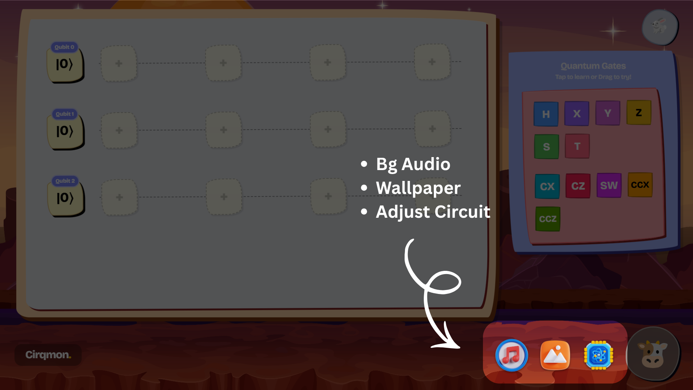
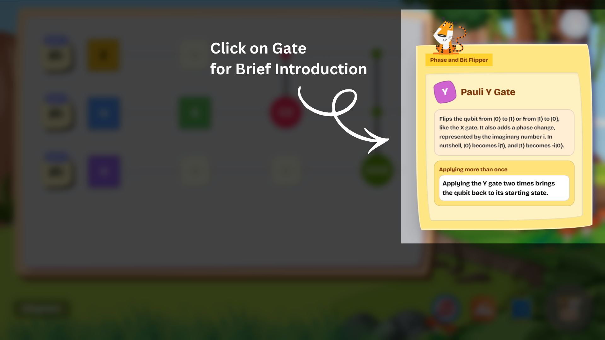
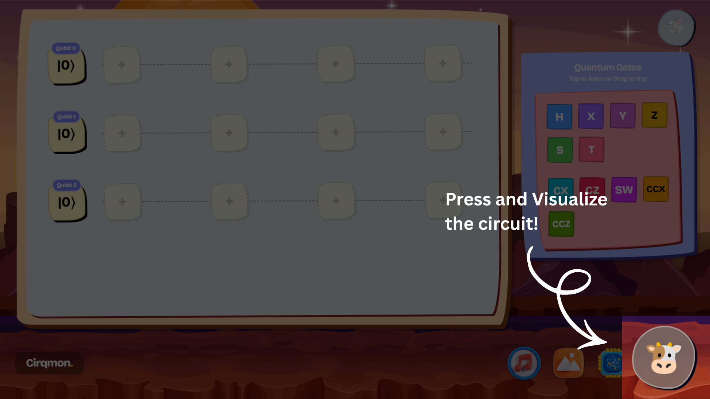

<p align="center">
  
</p>

<p align="center">
    
</p>

<p align="center"><em>Qubits made Fun! </em></p>
<p align="center">
   
   

</p>

***

<b>Cirqmon</b> is a Web based Quantum circuit maker, whose simulator and circuit execution happens inside browser without any backend, Execution is written from Scratch. Also its based on 3d Glassmorphism and more colorful, so that learning Quantum computing doesn't feel annoying. 



<b>Please Note:</b> Use bigger screens to Play bcause Cirqmon is not intended for Mobile usage.
<p align="center">
  <a href="https://cirqmon.vercel.app">
    
  </a>
</p>


## Why Cirqmon is made?

This project aims to be a simple but complete playground where you can:
1. Create quantum circuits effortlessly using an intuitive drag-and-drop canvas.
2. Understand and Visualize what the circuit is doing using interactive Q Sphere and Graph.
3. Export real Qiskit code you can immediately run in Python Qiskit SDK.

## What is Inside! 

- ### **Drag-and-drop circuit builder**  
  Place single and multi-qubit gates on a visual canvas. For better experience do try Cirqmon in full screen.

  

- ### **Includes Foundational Gates**  
  Builder works with Gates like `H`, `X`, `Y`, `Z`, `S`, `T`, `CX`, `CZ`, `SWAP`, `CCX` and `CCZ`. 
  
  <b>Where to find Gates</b>: You can find the Quantum gates just by clicking the Owl on top right.

  <b>Few Notes:</b>
  * If you want to Use the gates drag them into Canvas.
  * In order to remove the gate from circuit just tap on gate.

    

- ### **Vibe and Controls**  
  Here you can control Number of Qubits and Nodes. Also change wallpaper or work while listening to Audio, so you don't lose Vibe. 

    


- ### **Get Brief Introduction**  
  Click on gate (or Drag to use) to Know about that Gate in Brief.   

  

- ### **Statevector simulation**  
  Press Cow's face on bottom-right to See amplitudes and probabilities as you build.  

   


- ### **Q-Sphere Visualization**  
  Interactive Q-Sphere that shows amplitude and phase angle of every basis state. Same as What IBM uses. Phase angle node color is represented as corresponding color in that angle in HSL Wheel.

   

- ### **Probability Histogram**  
  Bar graph that shows measurement probabilities of possible states.

  

- ### **Qiskit Code export**  
  Get executable Qiskit code based on visual circuit canvas.   

  

## Example: Bell State   
1. Set 2 Qubit System
1.  Drag H onto qubit 0
1.  Drag CX with control on qubit 0 and target on qubit 1
1.  Observe the state become:
    
    ```
    |00⟩ ≈ 0.707

    |11⟩ ≈ 0.707
    ```
## Tech Stack (via Vite)


- **React:** Frontend

- **Javascript:** Simulator and Algorithms

- **Three.js:** Q-Sphere visualization

- **Tailwind CSS:** Styling


## Making your own Version

Clone the project
```bash
git clone https://github.com/decodeaditya/cirqmon
```

Go to the project directory
```bash
cd cirqmon
```

Install dependencies
```bash
npm install
```

Start the server
```bash
npm run dev 
```
## Devlogs/Updates
Cirqmon is made as Part of **Stardance summer program** organized by Hack club and NASA. The updates are posted on Stardance website as **Devlogs**.

Here is the Link - 
[**Cirqmon Devlogs**](https://stardance.hackclub.com/projects/1327)

## Contributing
Contributions are always welcome!      

If you find a bug or have an idea, open an issue. 

You can even Contribute to project by educating people about Quantum Computing using Cirqmon, that's why its made.  

## Acknowledgements

 - [**Magnific**](https://www.magnific.com/) - Images
 - [**Iconscout**](https://iconscout.com/) -  Images
- [**Flaticon**](https://flaticon.com/) -  Images
- [**Pixabay**](https://pixabay.com/music/) -  Audio
 - **Qiskit Global Summer School** - Helped me Learn a lot about Quantum computing

## Licenses


This project is licensed under the MIT License

## Author


[@decodeaditya](https://www.github.com/decodeaditya)

***

<div align="center">

  <p><em> Love what You do and Share it so others start loving it!</em></p>

  
</div>

